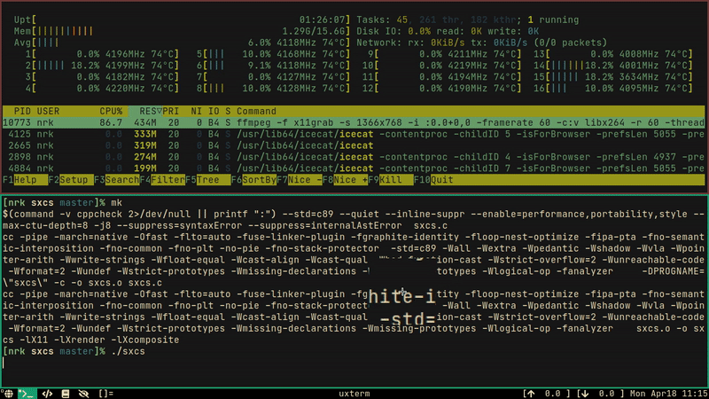

# sxcs - Simple X Color Sniper

Color picker for X11, also has zoom feature. Outputs TAB separated `hex`,
`rgb`, and `hsl` colors to `stdout` upon selection.



## Usage

Button1 will select and print the color, any other mouse button will quit sxcs.

Output format can be chosen via cli argument.
Zoom/magnification can be disabled via `--no-mag`.

```console
$ sxcs --rgb --no-mag
color:  rgb: 22 158 111
```

To see a list of all available cli arguments:

```console
$ sxcs --help
```

## Building

- Build Dependencies:
  * C89 compiler
  * make
  * necessary headers

- Runtime Dependencies:
  * C standard library
  * Xlib
  * Xrender
  * XComposite

***NOTE***: Makefile has some GCC specific optimization flags. Remove them from
`OFLAGS` if you're planning to use some other compiler.

```console
$ make
# or to override OFLAGS...
$ make CC=cc OFLAGS="-march=native -O2"
```

## TODOs

* Make it viable as a standalone magnifying application as well.

grep the source to find more TODOs:

```console
$ grep -Hn -E 'TODO|FIXME' sxcs.c
```
