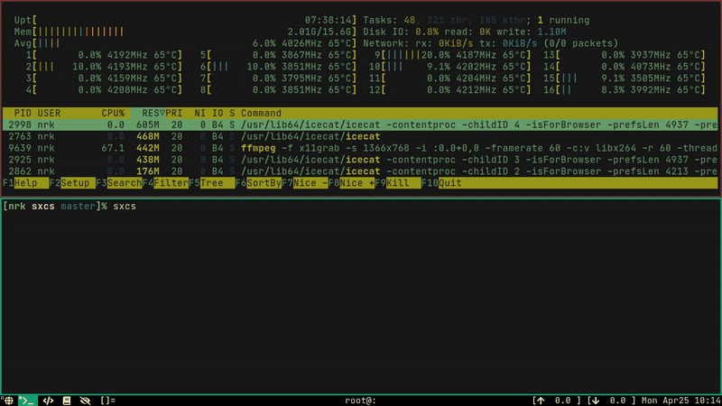
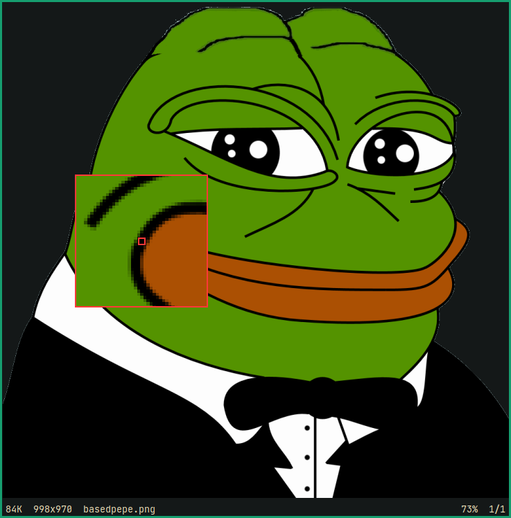
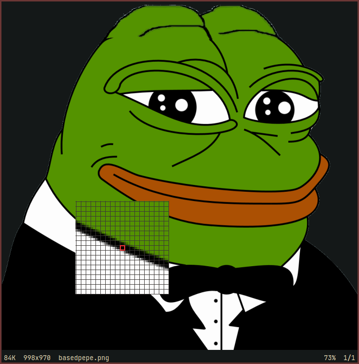

# sxcs - Simple X Color Sniper

Color picker and magnifier for X11.



## Usage

<kbd>Button1</kbd> will select and print the color to `stdout`, the output is
TAB separated `hex`, `rgb`, and `hsl`.
Any other mouse button will quit sxcs.

Output format can be chosen via cli argument.
Zoom/magnification can be disabled via `--mag-none`.

```console
$ sxcs --rgb --mag-none
rgb:	22 158 111
```

Copying the hex output to clipboard (using `xclip`):

```console
$ sxcs -o --hex | cut -f 2 | xclip -in -selection clipboard
```

Color output can be disabled via `--color-none`, which more or less turns
`sxcs` into a magnifier.

The magnifying window can be customized to have circular border with
`--broder circle`, or a square border with `--border square`. The grid and
crosshair can be disabled via `--grid no` and `--crosshair no` respectively.

The default filter set in config.h is equivalent to the following:

```console
$ sxcs --grid yes --crosshair yes --border circle
```

Following are a couple more examples:

```console
$ sxcs --grid no --crosshair yes --border square
```



```console
$ sxcs --grid yes --crosshair yes --border no
```



To see a list of all available cli arguments and filters:

```console
$ sxcs --help
```

## Building

- Build Dependencies:
  * C89 compiler
  * make
  * necessary headers

- Runtime Dependencies:
  * POSIX 2001 C standard library
  * Xlib
  * Xcursor

```console
$ make
# sudo make install
```

## Limitation

Cursor size bigger than 255x255 causes visual glitches, it seems to be a
X11/Xcursor limitation.

One alternative would be using XComposite and using an `override_redirect`
window. Which is what was being done (incorrectly) before commit
[33490dd](https://codeberg.org/NRK/sxcs/commit/33490ddf9164655bf6decafa6f85082e413fa333).
I suspect doing this correctly would require way too much code, probably above
my self imposed limit of ~800 SLoC for this project.

## TODOs

grep the source to find TODOs:

```console
$ grep -Hn -E 'TODO|FIXME' sxcs.c
```
